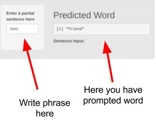

Coursera Data Science Capstone Project
========================================================
author: Emil Dabrowski
date: 01 September 2017
autosize: true

Introduction
========================================================

Goal of this project is create a word prediction model using R and Shiny application for presenting how prediction function is working. Model and project was made with optimization for speed and efficiency.

Link to Shiny App: https://emildabrowski.shinyapps.io/word_predict/

Link to Github repo: https://github.com/emildabrowski/capstone_final

Data preparation
========================================================

To create a proper model blog, news and twitter data was used. Firstly data was cleaned using tm module. Next n-grams were created and data was extracted into tables. Data was sorted and compressed by RDS.
Model was created based on the Katz Back-off algorithm (https://en.wikipedia.org/wiki/Katz%27s_back-off_model)

Model and application function
========================================================

Application is using sorted n-grams. Application cleans input data and using first 4-grams (last three words from input data are using to comaprison). If application haven't response from 4-grams, 3-grams and next 2-grams are using. If appliaction did not find any output word "the" is used.

Instruction
========================================================
Here is short instruction how to use this application:

